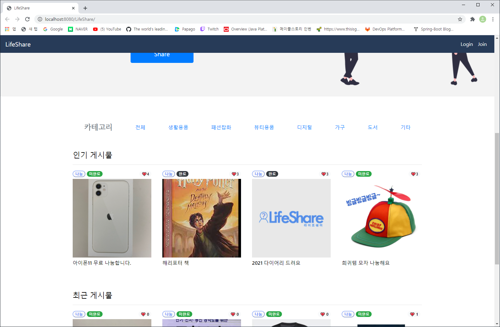

> **JavaSpring Framework Project**
 

<!--  -->
<!--  -->

### :heavy_check_mark:  주제 : 공유 플랫폼 웹사이트
  

> 1. Eclipse와 SourceTree 협업프로그램을 활용, Java Langage 이용  
> 2. 주변 자취생분들이 본인이 사용하고 있는 물품을 공유, 거래하는 웹사이트를 제작  
> 3. 로그인, 쪽지 전송, 게시글 기능이 구현된 프로젝트  

* 메인화면_중단  
  

> 거래가 교환인지, 나눔인지 구분한 게시글 확인이 가능하다.

* 로그인 화면  
  

> 회원가입, 로그인을 통해 웹사이트 Id 생성이 가능하다.
> SQL DB와 연동하였기 때문에 회원들을 관리할 수 있다.

* 게시글 페이지
  

> 게시글에는 사진, 설명, 좋아요, 수정하기 등을 진행할 수 있다.

### :heavy_check_mark: 팀 구성 및 기간
> 1. 팀 : 4인 1조
> 2. 팀이름 : Springday
> 3. 기간 : 총 7일
> 4. 참여방식 : Zoom을 이용한 온라인 화상회의

### :heavy_check_mark: 본인 맡은 일
> 1. 매일 회의록 정리 및 게시
> 2. 로그인 기능 구현
> 3. 전반적인 웹사이트 디자인 CSS 코딩

### :heavy_check_mark: 본인이 한 일 외에 나머지 소스코드
> 팀원들이 만든 소스코드라서, MvC 모델을 어떻게 활용했는지 알기 위해 기재하였다.
