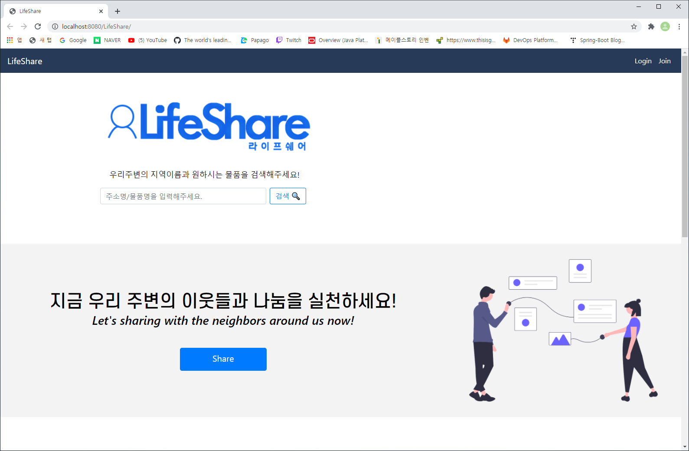

> **JavaSpring Framework Project**

주제 : 공유 플랫폼 웹사이트  

1. Eclipse와 SourceTree 프로그램, Java 언어 사용  
2. 주변 자취생분들이 본인이 사용하고 있는 물품을 공유, 거래하는 웹사이트를 제작  
3. 로그인, 쪽지 전송, 게시글 등의 기능이 구현된 프로젝트  

# 어떻게 진행되었나?
1. 팀원 : 4인 1조
2. 제작 기간 : 7일  

# 본인이 한 일 
1. 구글docx에 프로젝트 회의록 정리
2. 로그인 기능 구현
3. 웹사이트 디자인 CSS 프로그래밍 코딩

# 본인이 한 일 외에 나머지 소스코드의 용도
1. 팀원들이 어떻게 작성했는지 알아보기 위해 업로드
