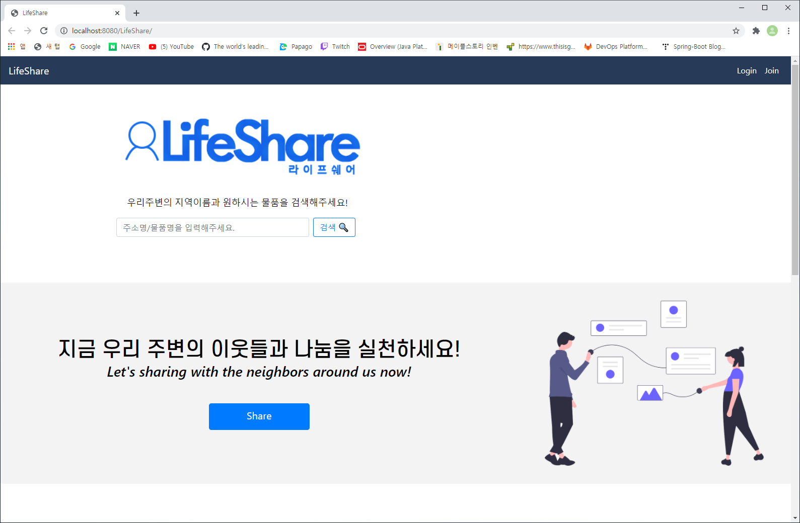

> **JavaSpring Framework Project**

거래 웹사이트

1. Eclipse와 SourceTree 프로그램, Java 언어 사용  
2. 주변 자취생분들이 본인이 사용하고 있는 물품을 공유, 거래하는 웹사이트를 제작  
3. 로그인, 쪽지 전송, 게시글 등의 기능이 구현된 프로젝트  

# 어떻게 진행되었나?
1. 팀원 : 4인 1조
2. 제작 기간 : 7일  
      1~2일 : 환경설정
      3일 : 업무 분담
      4일 : 업무에 대해 피드백
      5일 : 팀원들과 직접 만나서 피드백 및 스터디
      6일 : CSS 작업 및 마무리 작업
      7일 : 제출 및 발표
3. 본인이 한 일 : 매일 구글docx에 프로젝트 계획 및 한 일 정리, 로그인 기능, CSS

# 본인이 한 일 외에 나머지 소스코드의 용도
1. 팀원들이 어떻게 작성했는지 공부하기 위해 업로드
